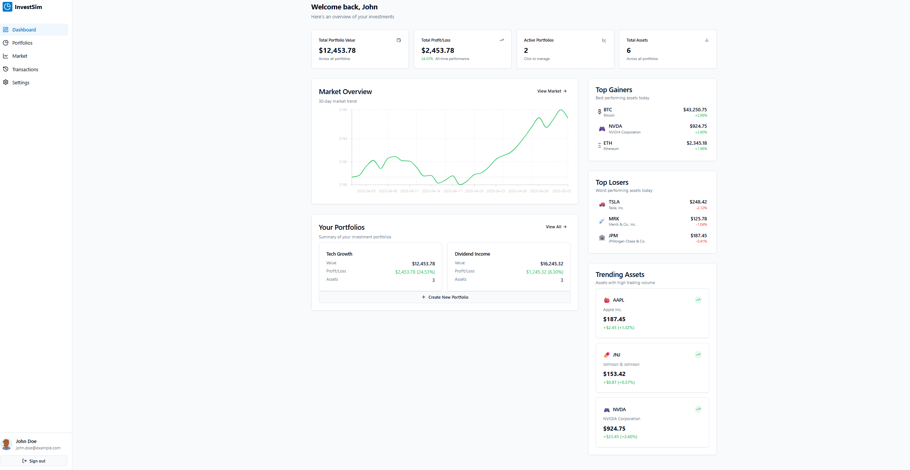
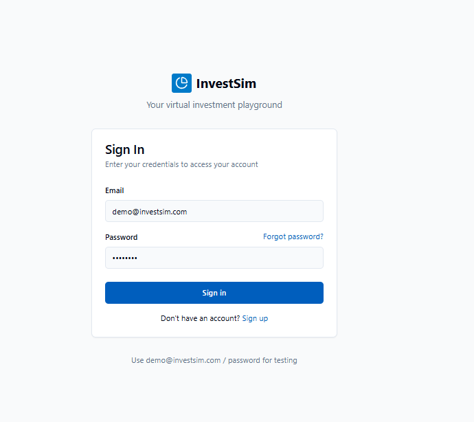

# InvestSim - Portal Inwestycyjny



## Cel projektu
Stworzenie interaktywnego portalu inwestycyjnego, który pozwala na:
- Symulowanie inwestycji w różne aktywa (akcje, kryptowaluty itp.) z wykorzystaniem fikcyjnych pieniędzy.
- Tworzenie wirtualnych portfeli inwestycyjnych.
- Analizę danych finansowych i wizualizację wyników.



## Technologie
- **Backend:** Python (FastAPI/Flask) do zarządzania logiką biznesową i integracji z bazą danych MongoDB.
- **Frontend:** React.js do stworzenia nowoczesnego i interaktywnego interfejsu użytkownika.
- **Baza danych:**
  - **MongoDB:** Do przechowywania danych użytkowników, transakcji i portfeli.
  - **PostgreSQL:** Do przechowywania ustrukturyzowanych danych, takich jak dane użytkowników i analizy finansowe.
- **Java:** Do obsługi modułów zaawansowanej analizy finansowej i symulacji rynkowych.
- **Tomcat:** Hostuje moduły w Javie, działające w kontenerach Docker.
- **Konteneryzacja:** Docker do izolacji aplikacji.
- **Hosting:** AWS lub DigitalOcean do wdrożenia aplikacji.
- **API rynkowe:** CoinMarketCap (darmowe API do pobierania danych kryptowalutowych).

## Funkcje

### Frontend
- **Autentykacja użytkowników**: System logowania i rejestracji
- **Dashboard**: Przegląd portfeli i najważniejszych wskaźników
- **Zarządzanie portfelami**: Tworzenie i edycja wirtualnych portfeli inwestycyjnych
- **Rynek**: Przeglądanie aktualnych cen aktywów z wykresami
- **Transakcje**: Kupno i sprzedaż aktywów z symulacją prowizji

### Backend
- API do zarządzania użytkownikami i autentykacją
- API do zarządzania portfelami inwestycyjnymi
- API do zarządzania transakcjami
- Integracja z zewnętrznymi źródłami danych rynkowych
- Obliczanie wskaźników inwestycyjnych i statystyk

## Plan działania

### Faza 1: Podstawowe funkcjonalności
1. Stworzenie struktury projektu (backend, frontend).
2. Implementacja rejestracji i logowania użytkowników.
3. Konfiguracja bazy danych MongoDB:
   - Kolekcje dla użytkowników, portfeli i transakcji.
4. Stworzenie mechanizmu obsługi portfeli inwestycyjnych:
   - Tworzenie portfeli.
   - Dodawanie fikcyjnych środków.
5. Stworzenie API dla frontend:
   - Rejestracja i logowanie.
   - Zarządzanie portfelami.

### Faza 2: Integracja danych rynkowych i transakcji
1. Integracja z CoinMarketCap:
   - Pobieranie kursów kryptowalut w czasie rzeczywistym.
   - Zapisywanie danych w MongoDB (cache).
2. Implementacja funkcji kupna i sprzedaży aktywów:
   - Weryfikacja salda portfela.
   - Aktualizacja stanu portfela i historii transakcji.
3. Dodanie mechanizmu przeliczania walut.

### Faza 3: Wizualizacje i analizy
1. Implementacja wykresów dla aktywów:
   - Historia cen (React.js + biblioteka Chart.js).
2. Analizy finansowe:
   - Obliczanie ROI, średniej zmienności, itp.
   - Moduł w Javie do zaawansowanych symulacji finansowych hostowany na Tomcat.
3. Ranking użytkowników na podstawie wyników portfeli.

### Faza 4: Edukacja i rozszerzenia
1. Dodanie sekcji edukacyjnej:
   - Porady inwestycyjne.
   - Materiały o strategiach inwestycyjnych.
2. Wirtualna giełda:
   - Handel aktywami między użytkownikami.
3. Integracja notyfikacji:
   - Powiadomienia o zmianach kursów.

## Uruchamianie projektu

### Wymagania
- Docker i Docker Compose
- Node.js (dla rozwoju frontendu)
- Python 3.9+ (dla rozwoju backendu)
- Java 11+ i Maven (dla modułu analitycznego)

### Uruchamianie z Dockerem
```bash
# Budowanie i uruchamianie wszystkich usług
docker-compose up --build

# Uruchamianie tylko frontendu
docker-compose up frontend

# Uruchamianie tylko backendu
docker-compose up backend